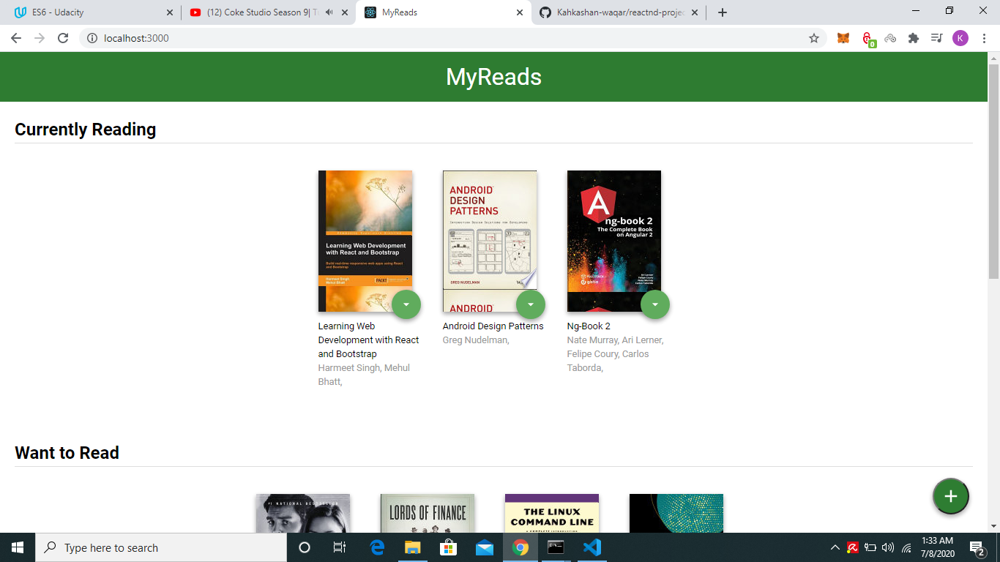
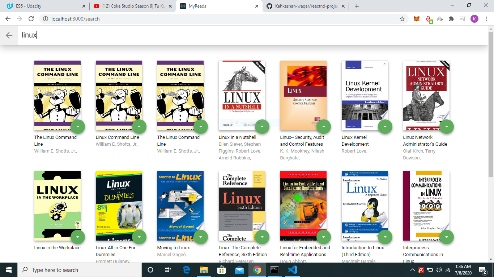
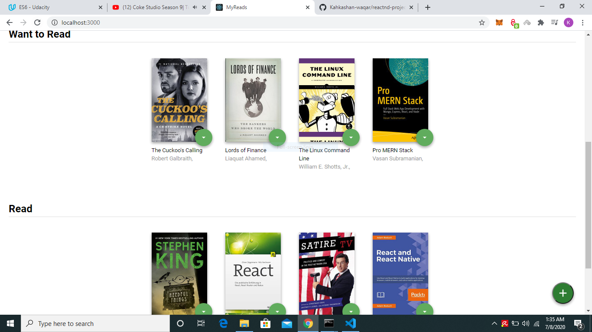

# MyReads Project

This repo is a code-along with the first project in the [React Nanodegree program](https://www.udacity.com/course/react-nanodegree--nd019).

Most of the commits in this repository correspond to videos in the program.

## Project Setup

* Download the project.
* Install the dependencies - `npm install`
* To get started - `npm start`

## Backend Server

The backend server for this in-class project can be found [here](https://github.com/udacity/reactnd-contacts-server).

# Screen Shots

## Home Page

## Search Page

## Book Shelves

